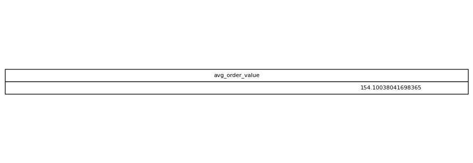

# Average Order Value

## Objective
Estimate the typical payment value per transaction.

## Tables Used
olist_order_payments_dataset

## Explanation
AVG computes the mean payment value across all payments.

## SQL Concepts
AVG
Aggregation

### Query Output

