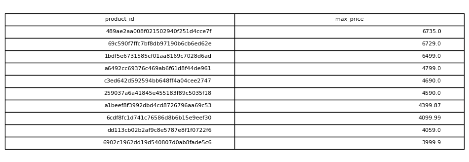

# Most Expensive Products

## Objective
Identify products that have been sold at the highest price.

## Tables Used
olist_order_items_dataset

## Explanation
Each product's maximum price is calculated and results are sorted
to return the top ten most expensive items.

## SQL Concepts
GROUP BY
MAX
ORDER BY
LIMIT

### Query Output

