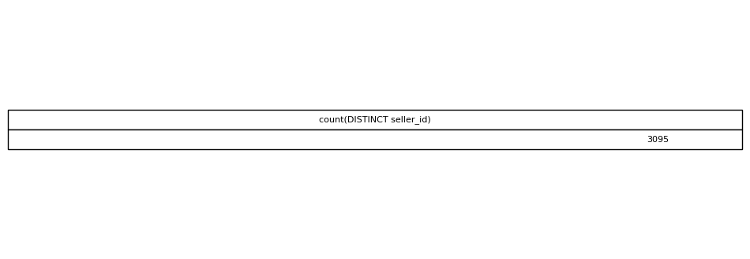

# Number of Sellers

## Objective
Determine the number of unique sellers on the platform.

## Tables Used
olist_sellers_dataset

## Explanation
Distinct seller IDs represent individual sellers.

## SQL Concepts
COUNT DISTINCT

### Query Output

