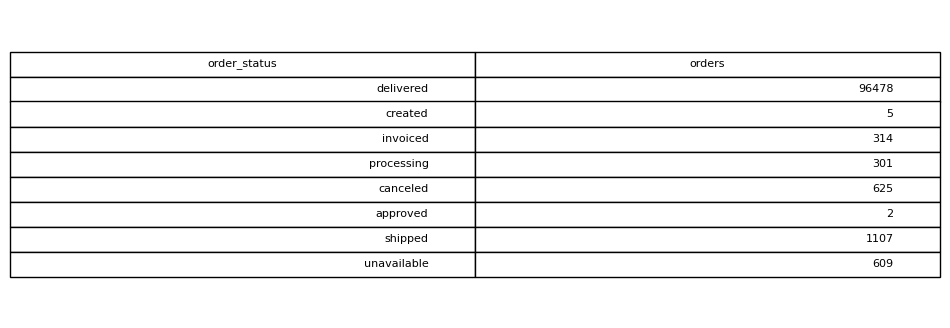

# Orders By Status

## Objective
Understand distribution of order statuses.

## Tables Used
olist_orders_dataset

## Explanation
Orders are grouped by status to show counts for delivered,
shipped, canceled, and other categories.

## SQL Concepts
GROUP BY
COUNT

### Query Output

