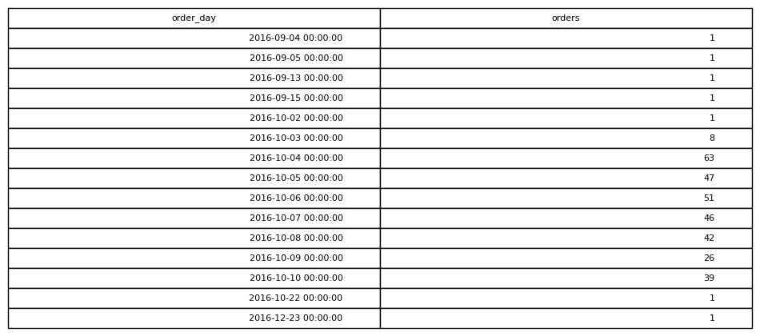

# Orders Per Day

## Objective
Understand order volume trends over time.

## Tables Used
olist_orders_dataset

## Explanation
The timestamp is converted into a date and grouped so we can count
how many orders were placed each day.

## SQL Concepts
DATE extraction
GROUP BY
ORDER BY

### Query Output

