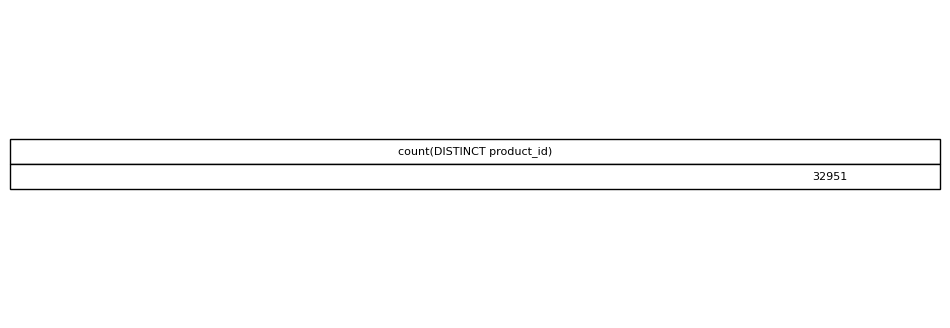

# Unique Products Sold

## Objective
Measure how many distinct products appear in order items.

## Tables Used
olist_order_items_dataset

## Explanation
DISTINCT ensures each product is counted only once.

## SQL Concepts
COUNT DISTINCT

### Query Output

