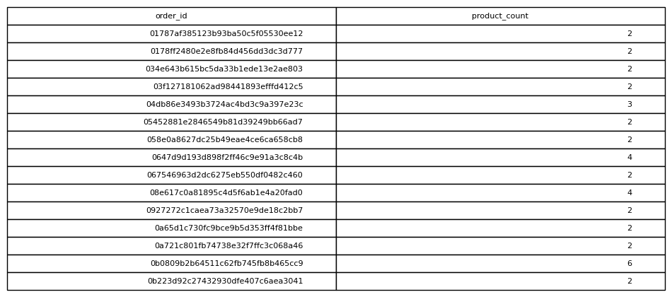

# Orders Containing Multiple Products

## Objective
Identify orders with more than one item.

## Tables Used
olist_order_items_dataset

## Explanation
Orders with item counts greater than one are filtered using HAVING.

## SQL Concepts
GROUP BY
HAVING

### Query Output

