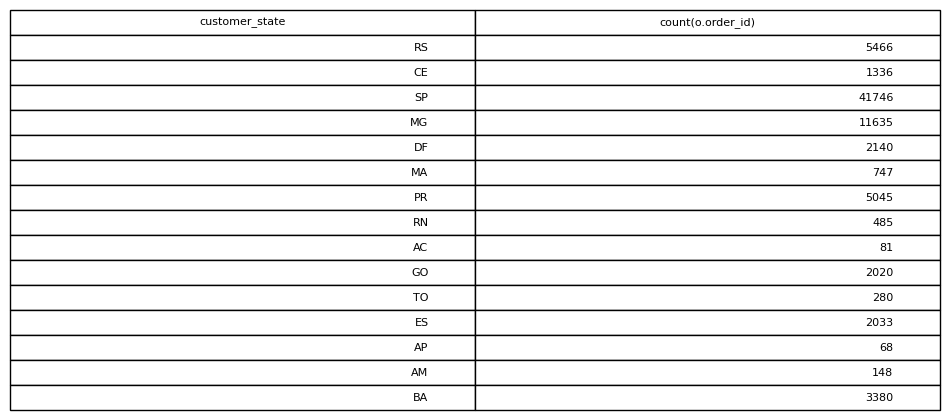

# Orders Per State

## Objective
Analyze geographic distribution of orders.

## Tables Used
olist_orders_dataset
olist_customers_dataset

## Explanation
Orders are joined with customer location data and grouped by state.

## SQL Concepts
JOIN
GROUP BY

### Query Output

