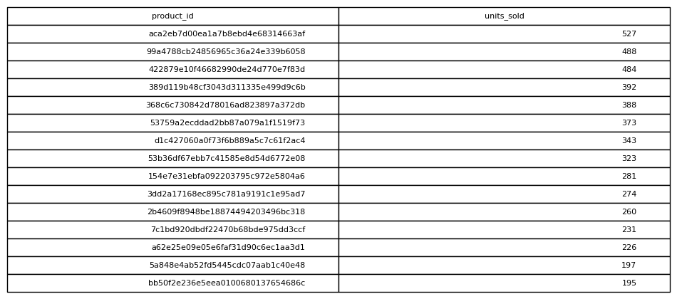

# Product Sales Count

## Objective
Determine which products are sold most frequently.

## Tables Used
olist_order_items_dataset

## Explanation
Each appearance of a product_id indicates a unit sold.

## SQL Concepts
GROUP BY
COUNT
ORDER BY

### Query Output

