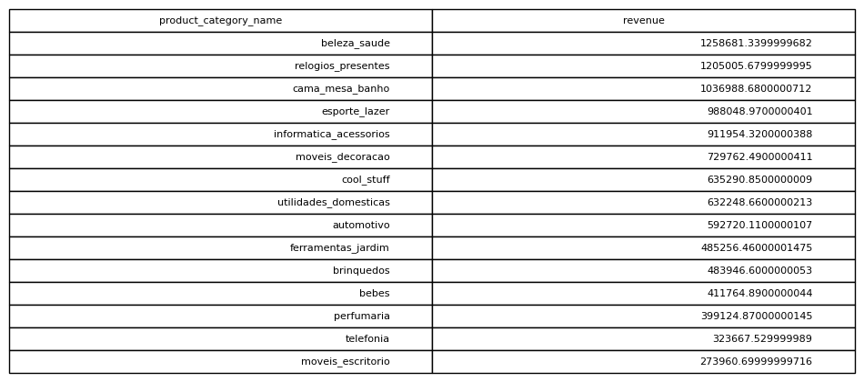

# Revenue By Category

## Objective
Understand which product categories generate the most revenue.

## Tables Used
olist_order_items_dataset
olist_products_dataset

## Explanation
Products are joined to their categories and revenue is aggregated.

## SQL Concepts
JOIN
GROUP BY
SUM

### Query Output

