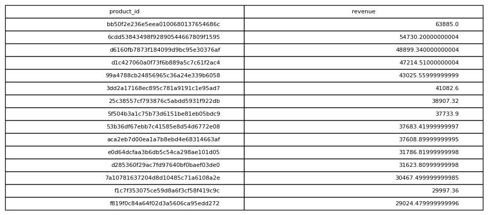

# Revenue By Product

## Objective
Identify the highest earning products.

## Tables Used
olist_order_items_dataset

## Explanation
Revenue is calculated by summing price for each product.

## SQL Concepts
SUM
GROUP BY

### Query Output

