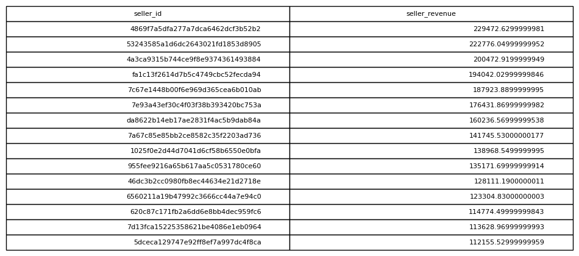

# Revenue By Seller

## Objective
Evaluate seller performance.

## Tables Used
olist_order_items_dataset

## Explanation
Sales revenue is aggregated by seller.

## SQL Concepts
GROUP BY
SUM
ORDER BY

### Query Output

