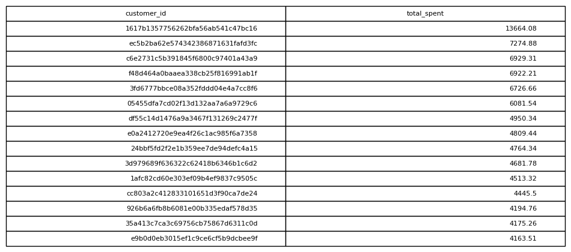

# Revenue Per Customer

## Objective
Measure how much each customer has spent.

## Tables Used
olist_orders_dataset
olist_order_payments_dataset

## Explanation
Orders are joined with payments and aggregated by customer.

## SQL Concepts
JOIN
SUM
GROUP BY
ORDER BY

### Query Output

