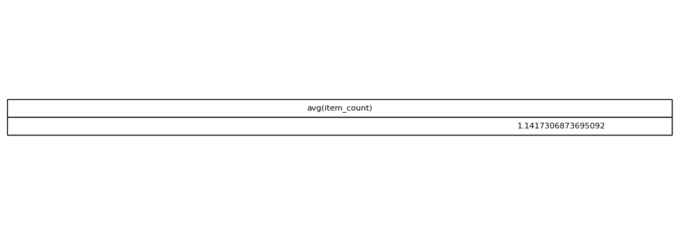

# Average Items Per Order

## Objective
Determine the average number of items included in an order.

## Tables Used
olist_order_items_dataset

## Explanation
First, items are counted per order using GROUP BY. The outer query then
calculates the average number of items across all orders.

## SQL Concepts
Subqueries
GROUP BY
COUNT
AVG

### Query Output

