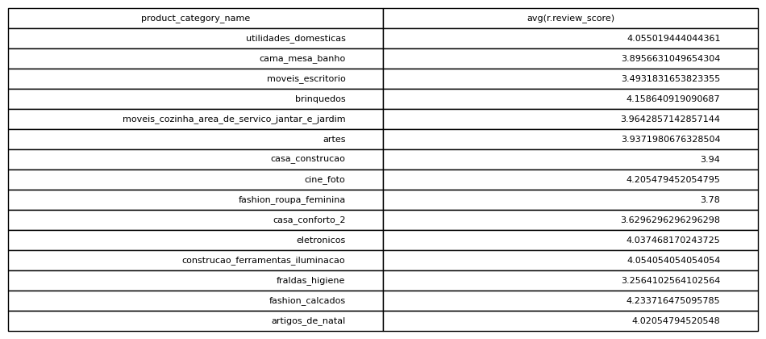

# Average Review Score By Category

## Objective
Measure product category satisfaction levels using review scores.

## Tables Used
olist_order_reviews_dataset
olist_orders_dataset
olist_order_items_dataset
olist_products_dataset

## Explanation
Orders are linked with reviews and product information. Review scores
are then averaged for each product category.

## SQL Concepts
JOIN
AVG
GROUP BY

### Query Output

