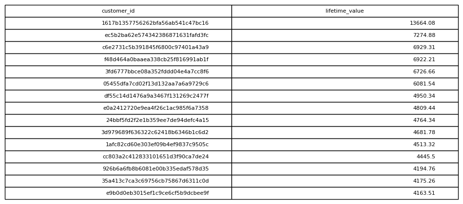

# Customer Lifetime Value

## Objective
Calculate the total amount each customer has spent.

## Tables Used
olist_orders_dataset
olist_order_payments_dataset

## Explanation
Orders are joined with payment records to calculate how much each
customer has spent in total across all purchases.

## SQL Concepts
JOIN
SUM
GROUP BY
ORDER BY

### Query Output

