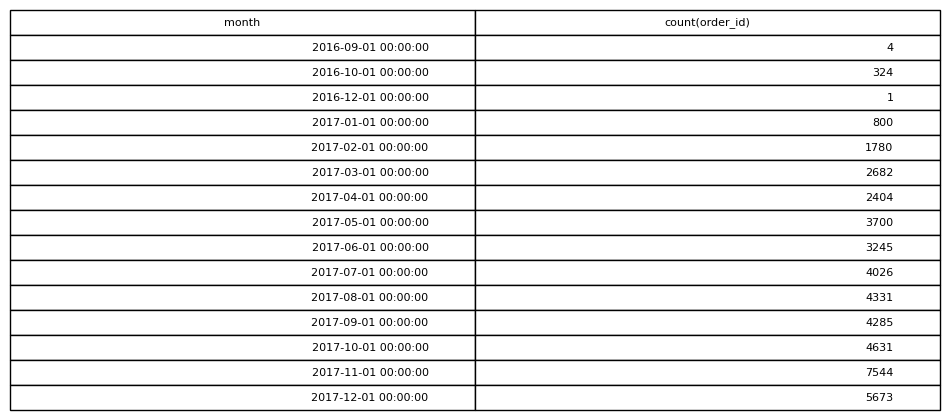

# Monthly Orders

## Objective
Analyze how many orders were placed each month.

## Tables Used
olist_orders_dataset

## Explanation
Order timestamps are truncated to the month level and grouped to count
how many orders occurred during each month.

## SQL Concepts
DATE_TRUNC
GROUP BY
COUNT
ORDER BY

### Query Output

