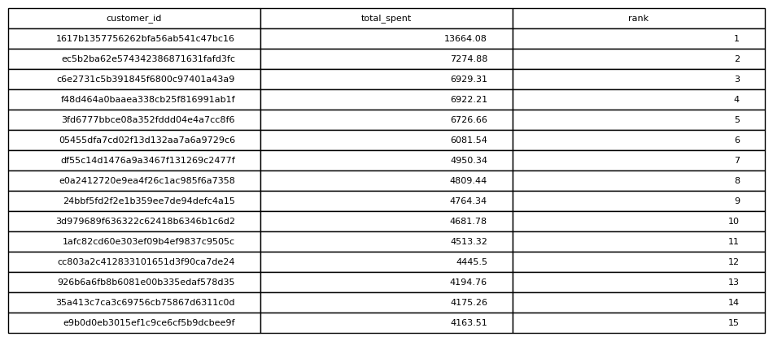

# Rank Customers By Spending

## Objective
Identify the highest spending customers.

## Tables Used
olist_order_payments_dataset
olist_orders_dataset

## Explanation
Customer payments are aggregated to compute total spending per customer.
A window function then ranks customers based on their total spending.

## SQL Concepts
JOIN
SUM
WINDOW FUNCTIONS
RANK()
GROUP BY

### Query Output

