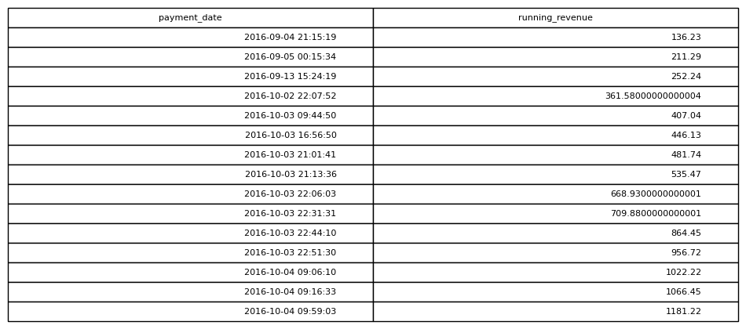

# Running Revenue

## Objective
Track cumulative revenue over time.

## Tables Used
olist_order_payments_dataset

## Explanation
The query uses a window function to compute a cumulative sum of payment
values ordered by date, producing a running total of revenue.

## SQL Concepts
WINDOW FUNCTIONS
SUM OVER()
ORDER BY

### Query Output

