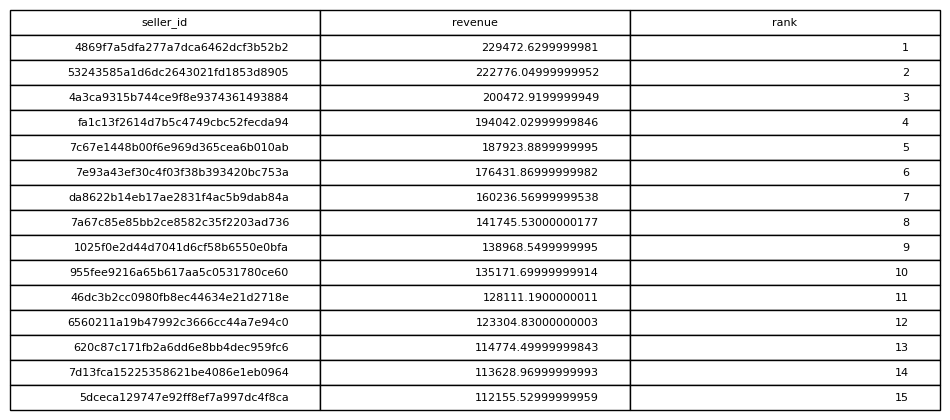

# Seller Revenue Ranking

## Objective
Rank sellers based on total revenue generated.

## Tables Used
olist_order_items_dataset

## Explanation
Revenue is calculated per seller by summing item prices. Sellers are
then ranked using a window function based on total revenue.

## SQL Concepts
GROUP BY
SUM
WINDOW FUNCTIONS
RANK()

### Query Output

