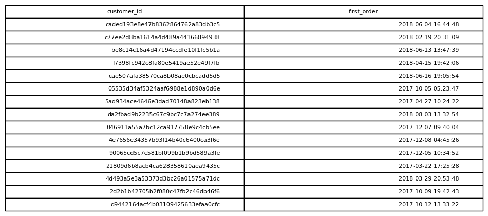

# First Purchase Per Customer

## Objective
Determine when each customer made their first purchase.

## Tables Used
olist_orders_dataset

## Explanation
The minimum purchase timestamp is selected for each customer,
representing the first time they placed an order.

## SQL Concepts
GROUP BY
MIN

### Query Output

